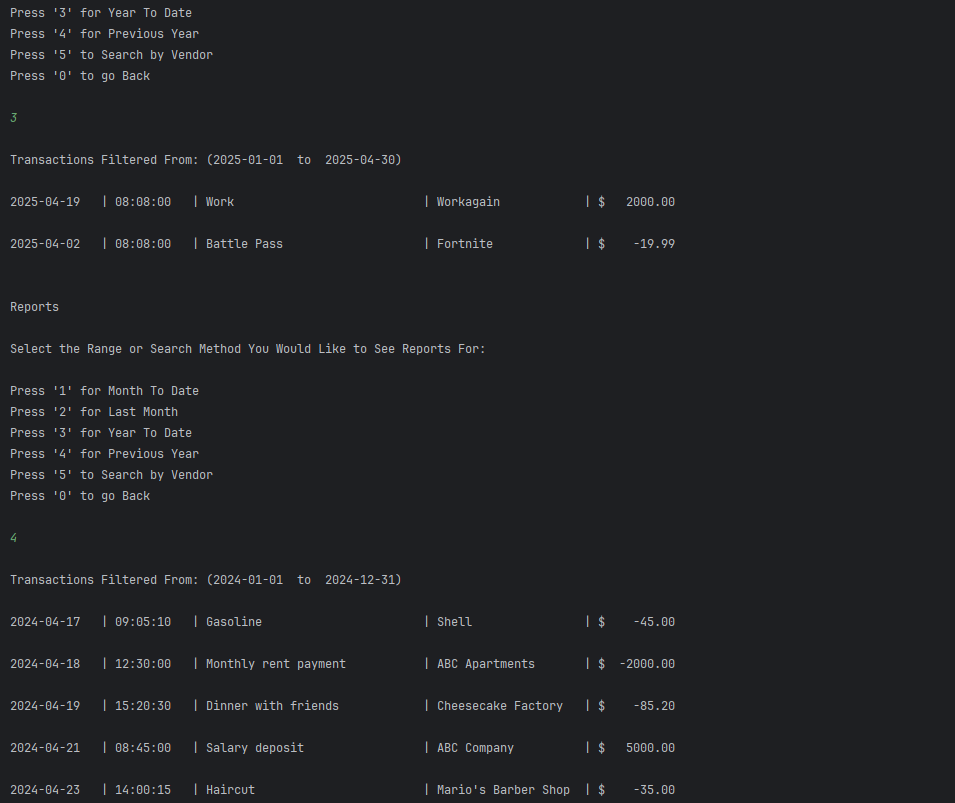

# Financial Tracker - Brandon Morse

## The Financial Tracker is a banking application that allows users to view and add transactions to a .csv file. These transactions can also be viewed separately as deposits or payments. In addition to this, the user can search for transactions based on the vendor name or date ranges!

## User Stories

List the user stories that guided the development of your application. Format these stories as: "As a [type of user], I want [some goal] so that [some reason]."

- As a customer, I want to be able to view my deposits and payments so that I can understand what transactions are being made in my name.

- As a customer, I want to be able to run a custom search to find transactions based on the vendor name so that I can quickly find a transaction

- As a customer I want to filter my transactions by certain date ranges so that I can find both recent and old transactions.

- As a developer, I want to ask the customer to re-enter an invalid date and time input when they are adding payments or deposits so they are not kicked back to the home screen afterward.

- As a developer, I want the application to be formatted neatly so the customer has an easier time of reading displayed information.

## Setup

1. Create the Financial Tracker class and Transaction class
2. Create the constructor, getters and setters in the Transaction class
3. Create a while loop that holds a switch case showing the home screen options for the Financial Tracker
4. Create a loadTransactions method that reads the .csv file and formats the date and time with a Date Formatter and Time Formatter
5. Add an addDeposit method and 2 try catches inside their own respective while loops to ask the user for the date and time and ask them again until they input them with the correct format
6. Create a buffered writer to write any newly added deposits to the .csv file
7. Repeat step 5 and 6 but for the addPayment method
8. Create a method that runs a switch case that asks the user what details inside the ledger they want to view
9. Create a displayDeposits and displayPayments method
10. Create a reportsMenu that asks the user for a range or search method they would like to see reports for
11. Create a filterTransactionsByDate method that handles cases 1-4 inside the reportMenu which allows the user to search based on a variety of date ranges
12. Create a filterTransactionsByVendor method that handles case 5 which allows the user to search for a transaction based on the name they enter

### Prerequisites

- IntelliJ IDEA: Ensure you have IntelliJ IDEA installed, which you can download from [here](https://www.jetbrains.com/idea/download/).
- Java SDK: Make sure Java SDK is installed and configured in IntelliJ.

### Running the Application in IntelliJ

Follow these steps to get your application running within IntelliJ IDEA:

1. Open IntelliJ IDEA.
2. Select "Open" and navigate to the directory where you cloned or downloaded the project.
3. After the project opens, wait for IntelliJ to index the files and set up the project.
4. Find the main class with the `public static void main(String[] args)` method.
5. Right-click on the file and select 'Run 'YourMainClassName.main()'' to start the application.

## Technologies Used

- Java (Amazon Corretto 17.0.14)

## Demo

## Future Work

- Custom Search to be Implemented Soon!

## Resources

- [W3 Schools for Documentation ](https://www.w3schools.com/java/ref_string_format.asp)

## Team Members

- **Brandon Morse** - Application Development (Method, constructor, getters and setters creation)

## Thanks!

- Thank you to Mr. Raymond for continuous support and guidance!
- A special thanks to all teammates for their dedication and teamwork.
 